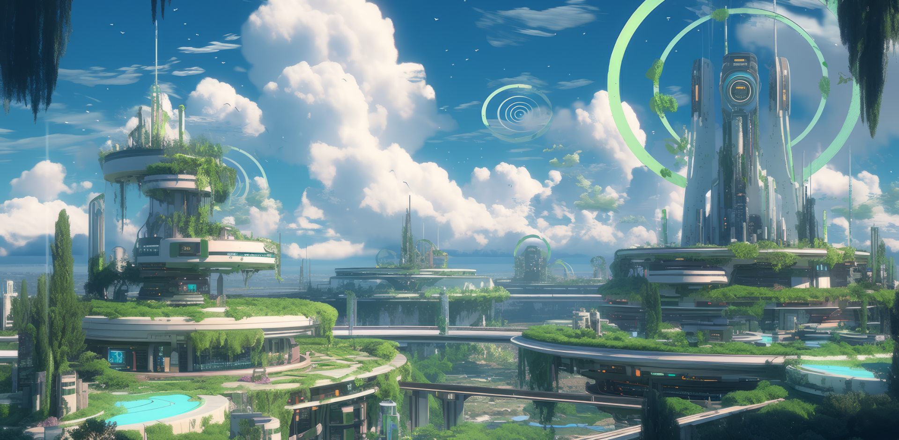
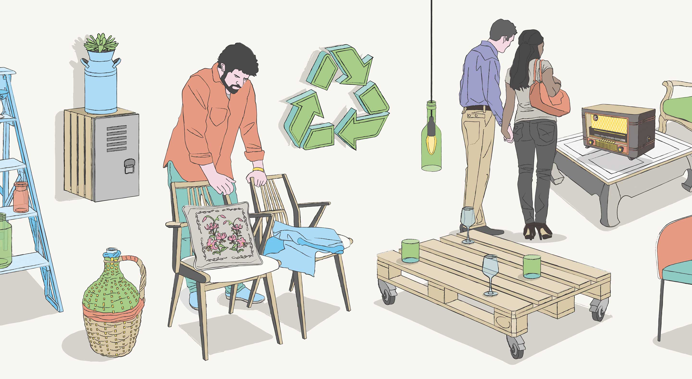
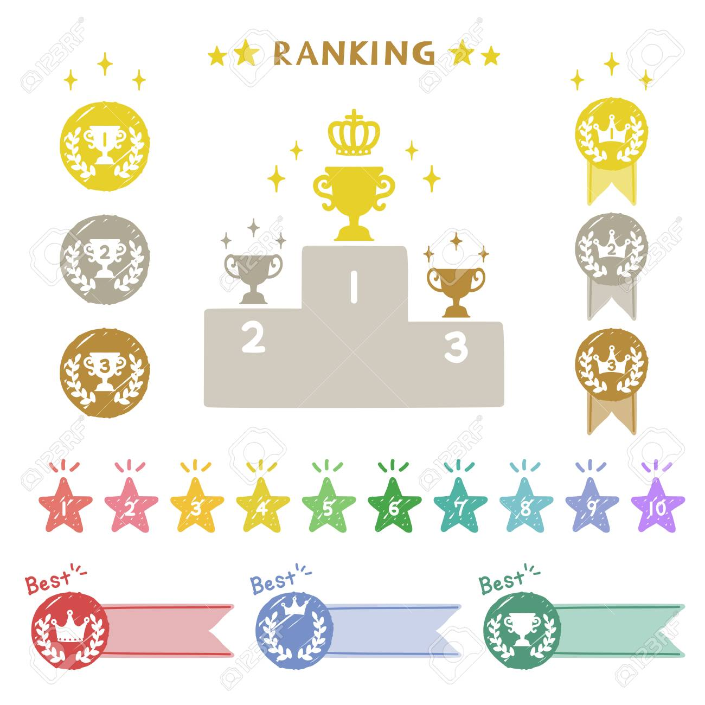

---
hide:
  - proyectos
  - navigation
  - toc
---

<!-- Full-width hero con scroll vertical -->

  <!-- Imagen completa sin cortes, con altura natural -->
  

  <!-- Texto sobre la imagen (opcional) -->
  

    <h1 style="font-size: 90px; color: #ffffffff; font-family: 'Georgia', serif; font-weight: bold; -webkit-text-stroke: 0.8px black;">ReCrea UNAB</h1>
    

    Participa en el ranking del reciclaje y
    crea objetos reciclados para tu hogar 
    o para uso cotidiano.

  

---

  <!-- Bloque 1: Imagen izquierda, texto derecha -->
  

    
  

  

    <h3>proyectos de reciclaje</h3>
    
Mira los proyectos que tenemos preparados, crealos y gana puntos acumulables para el Ranking!

  

---

  <!-- Bloque 2: Texto izquierda, imagen derecha -->
  

    <h3>Ranking</h3>
    
Mira las posiciones en el ranking, Desde aqui puedes inscribirte y subir tu progreso con los diferentes proyectos que tenemos preparados para ti.

  

  

    
  

