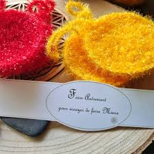
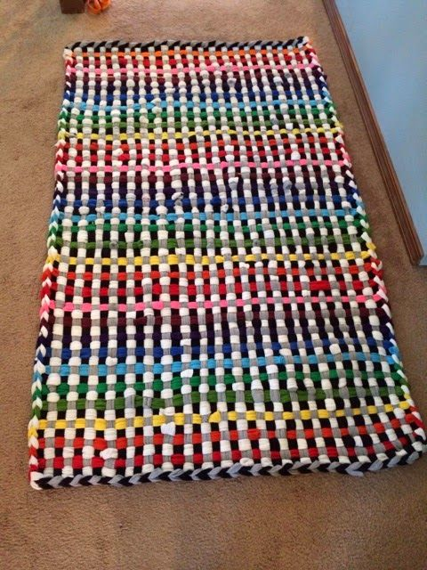
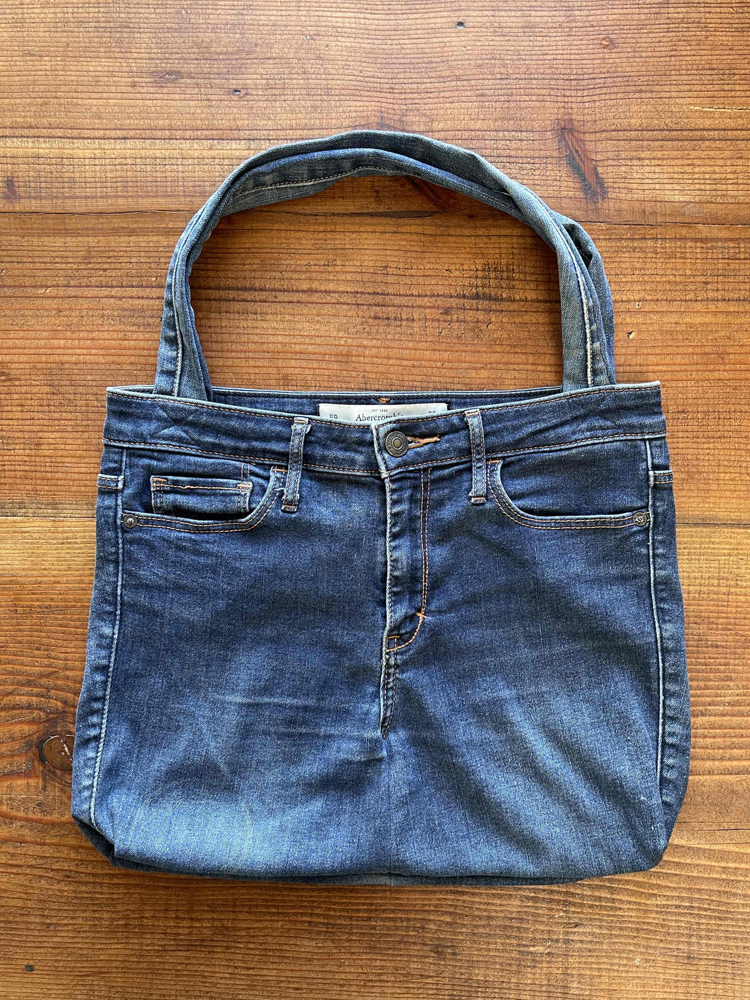

---
hide:
  - navigation
  - toc
---

 Tutoriales

---

 Esponja Tawashi

  <!-- IMAGEN con LINK al TUTORIAL COMPLETO -->
  

    
  

  <!-- MATERIALES -->
  

    <h2 style="margin-top: 0;">Materiales</h3>
    <ul>
      <li>Bolsas plásticas recicladas</li>
      <li>Tijeras</li>
      <li>Aguja gruesa</li>
      <li>Regla</li>
      <li>Cinta para medir</li>
      <li>Paciencia 😄</li>
    </ul>
  

---

# Descripción

  Una esponja reutilizable hecha con bolsas plásticas trenzadas.  
  Este proyecto promueve el reciclaje y es ideal para comenzar con manualidades ecológicas.

---

 Alfombra de ropa reciclada

  <!-- IMAGEN con LINK al TUTORIAL COMPLETO -->
  

    
  

  <!-- MATERIALES -->
  

    <h2 style="margin-top: 0;">Materiales</h3>
    <ul>
      <li>poleras viejas</li>
      <li>tela de mezclilla</li>
      <li>tijeras afiladas</li>
      <li>Regla</li>
      <li>Cinta para medir</li>
    </ul>
  

---

# Descripción

  La alfombra de trapillo reciclado es un proyecto sustentable hecho a partir de poleras, telas o prendas en desuso. Se transforman en tiras de trapillo que luego se tejen o se anudan sobre una malla para crear una alfombra decorativa, resistente y totalmente personalizada. Es una excelente forma de reutilizar textiles que normalmente terminarían en la basura.

---

 Tote bag

  <!-- IMAGEN con LINK al TUTORIAL COMPLETO -->
  

    
  

  <!-- MATERIALES -->
  

    <h2 style="margin-top: 0;">Materiales</h3>
    <ul>
      <li>jeans</li>
      <li>hilos resistentes</li>
      <li>Aguja gruesa o maquina de cocer</li>
      <li>tijeras</li>
    </ul>
  

---

# Descripción

  Una tote bag resistente y moderna hecha a partir de jeans viejos. Gracias a la durabilidad del denim, se obtiene una bolsa reutilizable perfecta para compras, estudio o uso diario.

---

Reciclaje

Obtén puntos por reciclar objetos cotidianos como latas, botellas, cartones y otros elementos esenciales 
para el cuidado del planeta, sin necesidad de mandar evidencias del reciclaje utilizando el boton de aqui abajo.

<a href="../proyectos/sube_tu_proyecto" style="background: #4CAF50; padding: 20px 20px; color: white;
  border-radius: 6px; text-decoration: none; display: flex; justify-content: center; font-size: 35px">
  Recicla
</a>